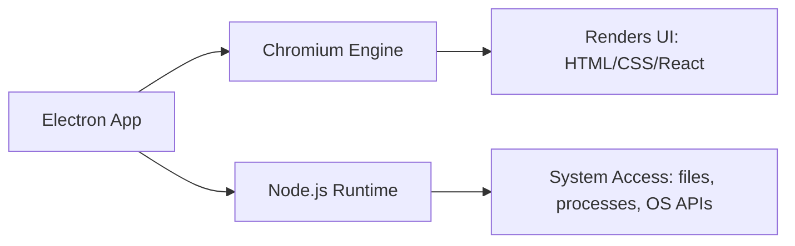
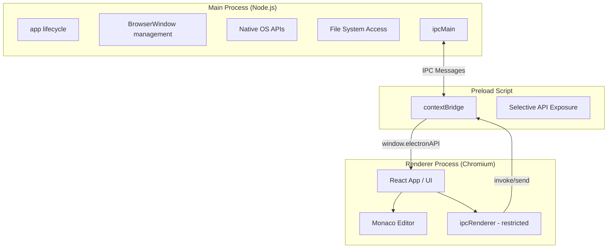
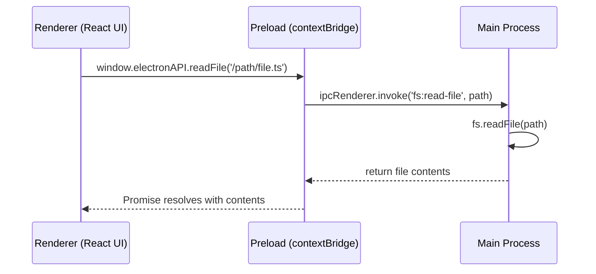
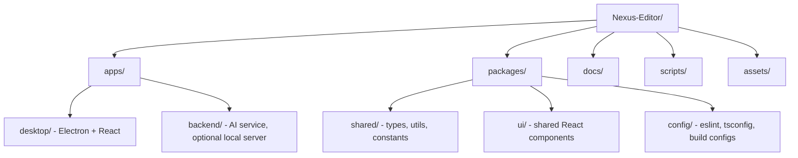

# Nexus Editor — Developer Handbook

> A production-grade documentation series for building an AI-powered desktop IDE with Electron, React, and Node.js.

**Audience:** Developers comfortable with React and Node.js, new to Electron.
**Status:** Chapter 1 of 15

---

## Table of Contents (Full Series)

1. Introduction *(this document)*
2. Project Architecture
3. Installation Guide
4. Electron Lifecycle
5. Communication (IPC)
6. File System
7. Monaco Editor
8. Terminal
9. Git Integration
10. AI Integration
11. Security
12. Packaging
13. Deployment
14. Best Practices
15. Learning Roadmap

---

# Chapter 1 — Introduction

## 1.1 What is Electron?

Electron is a framework that lets you build **desktop applications using web technologies** — HTML, CSS, and JavaScript (or TypeScript). Instead of learning a native language like C++, Swift, or C#, you write your app the way you'd write a website, and Electron wraps it into a real, installable desktop program for Windows, macOS, and Linux.

It does this by combining two things under one roof:

- **Chromium** — the same rendering engine that powers Google Chrome. This is what draws your UI (your React app, your buttons, your Monaco editor).
- **Node.js** — a JavaScript runtime that can talk to the operating system: read files, spawn processes, access the network at a low level, control windows, etc.

A normal website running in a browser tab can *only* use Chromium. It has no Node.js access, because letting random websites read your hard drive would be a catastrophic security hole. Electron's entire value proposition is that it lets you **combine both environments in one application**, under your control, with your own security boundaries.



For Nexus Editor, this is exactly what we need: a rich, React-based UI (file tree, tabs, Monaco editor, AI chat panel) that must also read and write real files on the user's disk, spawn a real terminal, and run Git commands — things a website can never do.

---

## 1.2 Why Electron Instead of a Web App?

You might ask: "Why not just build Nexus Editor as a web app that runs in the browser?" This is a fair question, and the answer comes down to **capabilities a browser sandbox intentionally forbids**.

| Requirement | Web App (Browser) | Electron Desktop App |
|---|---|---|
| Read/write arbitrary files on disk | ❌ Not without user picking each file manually | ✅ Full file system access |
| Spawn a real terminal (shell process) | ❌ Impossible | ✅ Via `node-pty` |
| Run Git commands directly | ❌ Impossible | ✅ Via `simple-git` / child processes |
| Watch folders for file changes | ❌ Very limited | ✅ Native file watchers |
| Work fully offline | ⚠️ Requires service workers, partial | ✅ Native, no server required |
| Native OS integration (tray, menus, notifications) | ⚠️ Limited | ✅ Full native APIs |
| Distribute as a single installable app | ❌ Needs a browser | ✅ `.exe`, `.dmg`, `.AppImage` |
| Auto-update mechanism | N/A (server-controlled) | ✅ Built-in (`electron-updater`) |

A code editor like VS Code, Cursor, or our Nexus Editor is fundamentally a **file system tool with a UI**. That UI can be a beautiful React app — but the moment you need to open a folder, read hundreds of files, watch them for changes, and spawn a terminal, you have left "web app" territory and entered "desktop app" territory. This is why VS Code, Slack, Discord, and Figma's desktop app are all built on Electron (or the conceptually similar Tauri).

**The tradeoff:** Electron apps are heavier (they ship a Chromium + Node.js runtime, so even a "hello world" app is ~100MB+), and you take on more responsibility for security since you now have real system access. Chapter 11 covers this in depth.

---

## 1.3 Electron Architecture

Electron's architecture is built around a **strict separation of responsibilities** between multiple processes. This is the single most important mental model to internalize before writing any code — almost every bug and security issue in Electron apps comes from misunderstanding this boundary.



Let's break down each piece.

### 1.3.1 Main Process

The **Main Process** is the entry point of every Electron app — a single Node.js process that starts when your app launches. Think of it as the "backend" of your desktop app, even though there's no server involved.

Its responsibilities:

- Creating and managing application windows (`BrowserWindow` instances)
- Controlling the app lifecycle (launch, quit, minimize, activate on macOS dock click, etc.)
- Having **full Node.js access** — it can read/write files, spawn child processes, access native modules
- Owning native OS integrations: application menus, system tray, native dialogs (Open Folder, Save As), notifications
- Listening for messages from renderer processes via `ipcMain` and responding to them

There is only **one Main Process** per app, no matter how many windows you open. In Nexus Editor, this is where file system operations, terminal spawning, and Git commands will actually execute — because only the Main Process has the Node.js APIs needed to do so.

### 1.3.2 Renderer Process

The **Renderer Process** is where your UI lives — one per `BrowserWindow`. This is essentially a Chromium browser tab running your React application. It renders HTML/CSS, runs your React component tree, handles user clicks, and displays the Monaco editor.

Critically, by default (and for good security reasons we'll explain in 1.3.6), the Renderer Process **does not have direct access to Node.js or the file system**. It behaves like a regular, sandboxed web page. If Nexus Editor's React UI wants to "open a folder," it cannot call `fs.readdir()` directly — it must *ask* the Main Process to do it on its behalf, through IPC.

You can have multiple renderer processes (multiple windows), and each one is isolated from the others, just like browser tabs are isolated from each other.

### 1.3.3 Preload Script

The **Preload Script** is a special script that runs in a unique, privileged context: it has access to a limited set of Node.js APIs (because Electron trusts it), *and* it runs before your web page's JavaScript loads, in the same window as the renderer.

Its job is to act as a **secure bridge** — it selectively exposes a small, controlled set of functions to the Renderer Process via `contextBridge`, without ever exposing raw Node.js or `ipcRenderer` wholesale. This is the "gatekeeper" pattern: the preload script decides exactly what the untrusted UI code is allowed to ask for.

For Nexus Editor, our preload script will expose something like `window.electronAPI.openFolder()`, `window.electronAPI.readFile(path)`, etc. — never the raw `fs` module.

### 1.3.4 IPC Communication

**IPC** stands for **Inter-Process Communication**. Since the Main Process and Renderer Process are two entirely separate OS processes (they don't share memory), they cannot call each other's functions directly. Instead, they pass messages back and forth — this is IPC.

Electron gives us two matching modules:

- `ipcMain` — used in the Main Process to *listen* for messages and *reply*
- `ipcRenderer` — used in the Preload Script to *send* messages and *receive* replies



This request/response pattern (`invoke` / `handle`) is the most common form of IPC and is covered in full depth, with every API explained, in **Chapter 5: Communication**.

### 1.3.5 Context Isolation

**Context Isolation** is a security feature (enabled by default since Electron 12, and mandatory for Nexus Editor) that ensures the JavaScript running in your preload script and the JavaScript running in your web page (React app) execute in **separate JavaScript contexts**, even though they share the same window.

Without context isolation, a malicious script running in your renderer (say, injected through a compromised npm package or an unsanitized AI-generated code preview) could potentially reach into and tamper with your preload script's privileged objects, and from there escalate to Node.js access. With context isolation **on**, the only communication channel between the two worlds is the explicit, narrow API you expose through `contextBridge` — nothing more.

**Rule for Nexus Editor:** Context Isolation is always `true`. There is no valid reason to disable it in a modern Electron app.

### 1.3.6 Security Best Practices

Given everything above, here are the foundational security rules that shape every architectural decision in this handbook (expanded fully in Chapter 11):

1. **`contextIsolation: true`** — always. Isolates preload/main-world JS contexts.
2. **`nodeIntegration: false`** — the Renderer Process must never have direct Node.js access.
3. **`sandbox: true`** where possible — further restricts what the renderer can do at the OS level.
4. **Never use `remote` module** — it's deprecated and dangerous; it blurred the Main/Renderer boundary.
5. **Validate all IPC input** — the Main Process must treat every message from a renderer as untrusted input, especially since Nexus Editor will render AI-generated content.
6. **Use a strict Content Security Policy (CSP)** — restricts what scripts/resources the renderer can load.
7. **Only expose the minimum API surface via `contextBridge`** — never expose `ipcRenderer` itself, only specific, purpose-built functions.

These aren't optional extras — they're the reason the Main/Renderer/Preload split exists at all. Every chapter from here on builds *on top of* this boundary, never around it.

---

## Common Mistakes (Chapter 1)

1. **Enabling `nodeIntegration: true` "to make things easier."** This defeats the entire security model and exposes the full Node.js API — including `require('fs')`, `require('child_process')` — to any script running in your UI, including third-party npm packages and (in our case) AI-generated content rendered in the UI.
2. **Thinking Electron is "just a browser wrapper."** It is a *two-process architecture with a security boundary*, not a single environment. Beginners often write code assuming the renderer can do anything Node.js can.
3. **Putting file system logic in the Renderer Process.** Even with `nodeIntegration` off, some developers try to route around the design by disabling isolation "temporarily." All file/OS access belongs in the Main Process, full stop.
4. **Confusing "Main Process" with "backend server."** There's no HTTP server involved (unless you add one for a specific feature); Main Process communication happens via IPC, not `fetch`.
5. **Assuming one Main Process per window.** There is exactly **one** Main Process for the entire app, regardless of how many `BrowserWindow`s exist.

---

## Interview Questions (Chapter 1)

1. What are the three core building blocks of an Electron app, and what does each one own?
2. Why can't a Renderer Process directly call `fs.readFile()`, even though Electron bundles Node.js?
3. Explain the role of the preload script and why it runs in a "privileged but isolated" context.
4. What does `contextIsolation` actually protect against? Give a concrete attack scenario it prevents.
5. Why would a code editor application (like VS Code or Nexus Editor) choose Electron over a pure web app? Name at least three capabilities that require it.
6. What is the difference between `nodeIntegration` and `contextIsolation` — are they the same setting?
7. How many Main Processes exist in an Electron app with 3 open windows? How many Renderer Processes?

---

## Practical Exercises (Chapter 1)

**Exercise 1.1 — Process Mapping**
Draw (on paper or in Mermaid) the Nexus Editor architecture showing: Main Process, one Renderer Process, and the Preload script. Label which process would be responsible for: (a) opening a folder picker dialog, (b) rendering the file tree, (c) reading a `.ts` file's contents, (d) running `git status`.

**Exercise 1.2 — Security Reasoning**
Without writing code yet, explain in your own words: if Nexus Editor's AI assistant generates a code snippet and displays it in the Renderer Process, why is it critical that the Renderer has no direct Node.js access, even if the AI-generated code looks harmless?

**Exercise 1.3 — Research**
Look up how VS Code structures its Main/Renderer split (it's open source). Identify one design decision that matches what you learned in this chapter.

---

*End of Chapter 1.*

---

# Chapter 2 — Project Architecture

## 2.1 Why a Monorepo?

Nexus Editor is not one app — it's actually a small ecosystem: a desktop shell, a backend/AI service layer, shared types, build tooling, and documentation. Cramming all of that into a single flat folder gets unmanageable fast (imagine your React components, your Electron main-process code, your AI prompt templates, and your build scripts all fighting for space in one `src/`).

Instead, Nexus Editor uses a **monorepo** — one Git repository containing multiple, clearly separated packages/apps that can depend on each other, be built independently, and be versioned together. This is the same strategy used by VS Code, Slack's desktop client, and most serious Electron products at scale.



## 2.2 Full Folder Structure

```
Nexus-Editor/
│
├── apps/
│   ├── desktop/                  # The Electron application itself
│   │   ├── src/
│   │   │   ├── main/             # Main Process code
│   │   │   │   ├── index.ts      # App entry point (app.whenReady, etc.)
│   │   │   │   ├── windows/      # BrowserWindow creation & management
│   │   │   │   ├── ipc/          # ipcMain handlers, grouped by domain
│   │   │   │   ├── fs/           # File system logic (read/write/watch)
│   │   │   │   ├── terminal/     # node-pty integration
│   │   │   │   └── git/          # simple-git integration
│   │   │   │
│   │   │   ├── preload/          # Preload scripts
│   │   │   │   └── index.ts      # contextBridge API exposure
│   │   │   │
│   │   │   └── renderer/         # Renderer Process = the React app
│   │   │       ├── src/
│   │   │       │   ├── components/
│   │   │       │   ├── pages/
│   │   │       │   ├── editor/   # Monaco integration
│   │   │       │   ├── ai/       # AI chat panel, context builder UI
│   │   │       │   ├── hooks/
│   │   │       │   └── state/    # Zustand/Redux store
│   │   │       ├── index.html
│   │   │       └── vite.config.ts
│   │   │
│   │   ├── electron-builder.yml  # Packaging config
│   │   └── package.json
│   │
│   └── backend/                  # AI orchestration service (can run locally or remote)
│       ├── src/
│       │   ├── agents/           # RAG pipelines, embeddings, prompt logic
│       │   ├── routes/           # If exposed via local HTTP server
│       │   └── index.ts
│       └── package.json
│
├── packages/
│   ├── shared/                   # Code shared between desktop & backend
│   │   ├── types/                # Shared TypeScript interfaces (IPC contracts!)
│   │   ├── constants/
│   │   └── utils/
│   │
│   ├── ui/                       # Shared, reusable React components (buttons, modals)
│   │
│   └── config/                   # Centralized eslint, prettier, tsconfig base files
│
├── docs/                         # This handbook, ADRs, architecture diagrams
│
├── scripts/                      # Build, release, codegen, CI helper scripts
│
├── assets/                       # App icons, installer graphics, splash screens
│
├── .github/
│   └── workflows/                # CI/CD pipelines
│
├── package.json                  # Root workspace config
├── pnpm-workspace.yaml           # (or turbo.json / nx.json)
└── tsconfig.base.json
```

## 2.3 Why Every Folder Exists

### `apps/desktop/` — Where Electron Lives
This is the actual shipped product: the Electron shell. It contains three clearly separated subfolders that map **directly** onto the architecture from Chapter 1:

- `main/` → Main Process code. Anything that touches the file system, spawns processes, manages windows, or talks to the OS lives here. Notice it's further split by *domain* (`fs/`, `terminal/`, `git/`, `ipc/`) rather than dumped into one file — at production scale, a single `main.js` with 3,000 lines is unmaintainable.
- `preload/` → The bridge scripts. Kept separate because they have a different build target and a different security posture than both main and renderer code.
- `renderer/` → This is where your **frontend lives** — the entire React application, including the Monaco editor integration, the AI chat UI, and all visual components. It's built with Vite and, critically, has *no* Node.js access at runtime (per Chapter 1's security model), even though it physically sits inside the same folder tree.

### `apps/backend/` — Where AI/Server Logic Lives
Even though Nexus Editor is a desktop app, the AI features (RAG pipeline, embeddings, prompt orchestration — Chapter 10) are complex enough to deserve their own package, separate from Electron's main process. This keeps `main/` focused on OS/window concerns, and keeps AI logic testable and potentially reusable (e.g., if you ever offer a cloud-hosted version of Nexus Editor's AI features).

### `packages/shared/` — Shared Code
The **most important** package for correctness. IPC (Chapter 5) relies on Main and Renderer agreeing on exact function signatures and payload shapes. If you define `readFile(path: string): Promise<string>` in the main process but the renderer expects `Promise<{content: string, encoding: string}>`, you get silent runtime bugs. `packages/shared/types/` holds the single source of truth for these contracts, imported by both `main/` and `renderer/`.

### `packages/ui/` — Shared Components
Purely visual, reusable React pieces (buttons, dialogs, tooltips) that might be used across multiple parts of the renderer, or even a future companion web app (e.g., a marketing site or docs site using the same design system).

### `packages/config/` — Shared Configs
Centralizes `eslint`, `prettier`, and base `tsconfig.json` so `apps/desktop` and `apps/backend` don't duplicate (and drift out of sync on) linting/formatting rules.

### `docs/` — Documentation
This handbook lives here, along with Architecture Decision Records (ADRs) — short markdown files documenting *why* a significant technical choice was made (e.g., "why pnpm over npm," "why Zustand over Redux"). Six months from now, you'll thank yourself.

### `scripts/` — Build & Automation
Custom Node.js/shell scripts for tasks that don't belong in `package.json` one-liners: generating icons for all platforms, bumping versions across all `package.json` files in the monorepo, running release checklists.

### `assets/` — Static/Build Assets
Not runtime assets used by the React app (those live in `renderer/public/`) — this is specifically for **build-time and installer** assets: app icons (`.ico`, `.icns`, `.png` at various sizes), DMG background images, installer splash screens. `electron-builder` (Chapter 12) reads directly from here.

### Root-level files
- `package.json` at the root defines the **workspace** (via `pnpm-workspace.yaml`), not a runnable app itself. It holds dev-tooling dependencies shared across the repo (TypeScript, ESLint, Prettier, Turborepo/Nx if used) and workspace-wide scripts like `pnpm build` that fan out to every app/package.
- `tsconfig.base.json` — the root TypeScript config that every package extends, enforcing consistent compiler options (strict mode, module resolution) project-wide.

## 2.4 Build vs. Production Folders

It's worth explicitly separating **source** from **output**, since this trips up beginners:

| Folder | Purpose | Committed to Git? |
|---|---|---|
| `apps/desktop/src/` | Hand-written source code | ✅ Yes |
| `apps/desktop/dist/` | Compiled output (Vite build of renderer, tsc output of main) | ❌ No (`.gitignore`) |
| `apps/desktop/release/` | Final packaged installers (`.exe`, `.dmg`, `.AppImage`) from `electron-builder` | ❌ No |
| `node_modules/` | Installed dependencies (per-package, hoisted by pnpm) | ❌ No |

`dist/` is intermediate — it's what actually gets loaded by Electron in production mode (Chapter 4 explains dev vs. production loading in detail). `release/` is the final, distributable artifact — what a user downloads and double-clicks to install.

---

## Common Mistakes (Chapter 2)

1. **Mixing main-process and renderer-process code in the same folder/file.** If `src/utils/fileHelpers.ts` is imported by *both* a main-process file and a renderer component, you risk accidentally bundling Node.js-only code (like `fs`) into the renderer bundle, which will break or create security holes.
2. **Putting IPC type definitions in only one side (main or renderer).** This guarantees drift. Always define IPC contracts once, in `packages/shared/types/`, and import from both sides.
3. **Treating `assets/` and `public/` as the same thing.** `public/` (inside the renderer) is for runtime UI assets bundled into the app; `assets/` at the root is for build-time installer assets. Confusing them causes broken icons in production builds.
4. **Committing `dist/`, `release/`, or `node_modules/` to Git.** Bloats the repo and causes merge conflicts on generated files.
5. **Flat, unstructured `main/` folder.** A single giant `main.js` handling windows, IPC, file system, terminal, and Git all in one file becomes unreadable past a few hundred lines. Split by domain early.

---

## Interview Questions (Chapter 2)

1. Why does a production Electron app benefit from a monorepo structure instead of one flat repository?
2. What kind of code should live in `packages/shared/` versus `packages/ui/`? Give an example of each.
3. Why is it dangerous for a utility file to be imported by both `main/` and `renderer/` code without care?
4. What's the difference between `assets/` at the project root and a `public/` folder inside the renderer app?
5. Explain the purpose of `dist/` vs `release/` in the build pipeline.
6. Why should IPC payload types be defined in a shared package rather than duplicated in main and renderer?

---

## Practical Exercises (Chapter 2)

**Exercise 2.1 — Structure From Scratch**
Without copying the example above, sketch your own version of the Nexus Editor folder tree from memory, based only on the responsibilities you learned in Chapter 1 (Main/Renderer/Preload). Then compare it to the structure in this chapter and note any differences.

**Exercise 2.2 — Contract Design**
Design (on paper, in TypeScript syntax, no implementation) the shared type for a single IPC contract: `fs:read-file`. Define the request payload and the response payload as they'd live in `packages/shared/types/`.

**Exercise 2.3 — Audit**
Pick any real open-source Electron app on GitHub (VS Code, Obsidian's community plugins, or similar). Identify: where is their main process code, where is their renderer code, and do they use a monorepo structure? Compare to Nexus Editor's approach.

---

*End of Chapter 2. Chapter 3 (Installation Guide) covers setting up Node.js, pnpm, Git, VS Code, Electron, React, Vite, and TypeScript from scratch — plus a full explanation of ESM vs. CommonJS and why Nexus Editor picks one over the other.*

**Say "next chapter" or "continue" to generate Chapter 3.**
